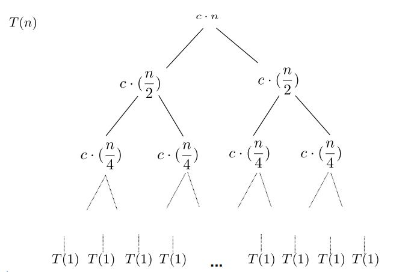

## Merge Sort O(n log n)

> Mergesort is a divide and conquer algorithm that was invented by John von Neumann in 1945. - Wikipedia

> Conceptually, a merge sort works as follows:
> - Divide the unsorted list into n sublists, each containing 1 element (a list of 1 element is considered sorted).
> - Repeatedly merge sublists to produce new sorted sublists until there is only 1 sublist remaining. This will be the sorted list.

# 

# 

# 
