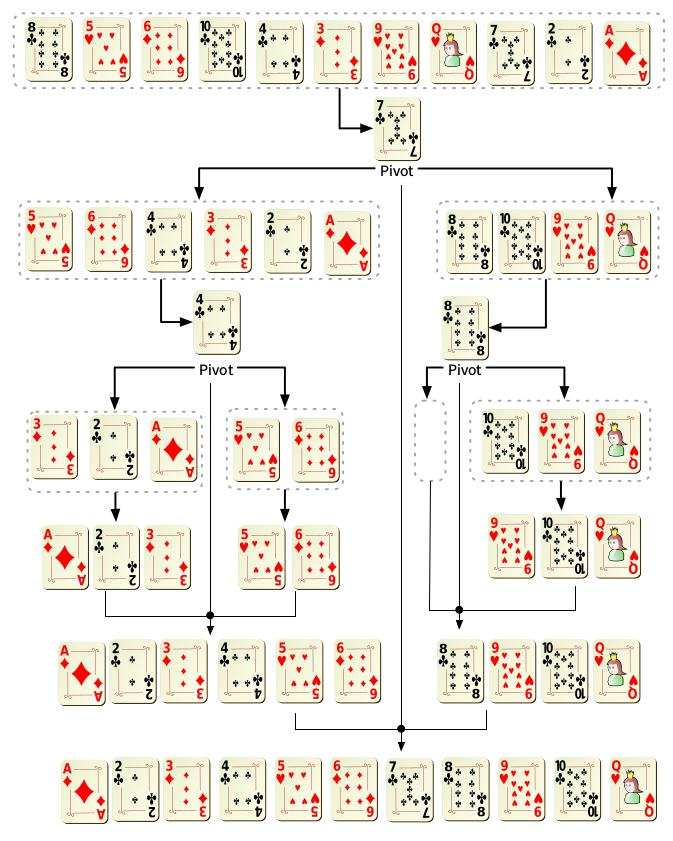

## Quick Sort O(n log n)

> Mathematical analysis of quicksort shows that, on average, the algorithm takes O(n log n) comparisons to sort n items. In the worst case, it makes O(n2) comparisons, though this behavior is rare.

> Quicksort is a divide and conquer algorithm. Quicksort first divides a large array into two smaller sub-arrays: the low elements and the high elements. Quicksort can then recursively sort the sub-arrays.

> The steps are:

> 1.Pick an element, called a pivot, from the array.
> 2. Partitioning: reorder the array so that all elements with values less than the pivot come before the pivot, while all elements with values greater than the pivot come after it (equal values can go either way). After this partitioning, the pivot is in its final position. This is called the partition operation.
> 3.Recursively apply the above steps to the sub-array of elements with smaller values and separately to the sub-array of elements with greater values.

>The base case of the recursion is arrays of size zero or one, which never need to be sorted.

> - Wikipedia

# 

# 

